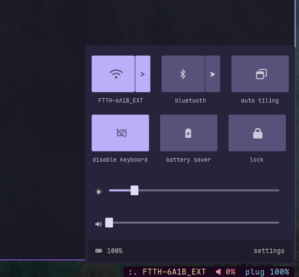

# AW Panel

A minimal **control panel** made using [Astal ags](https://github.com/Aylur/ags)  
intended for lightweight window manger setups like mine sway,hyprland etc


---

##  Features
- Toggle and connect to WIfi networks
- Adjust volume and brightness with sliders  
-  Toggle and connect to Bluetooth devices  
-  View battery status and info  

---

### Dependenices
- libastal-meta 
- libastal
- ags

### USAGE
Clone the repo into your AGS config folder:
```bash
git clone https://github.com/your-username/ags-control-center ~/.config/ags/widgets/control-center
````

add this line to your sway config 

```json

exec_always ags run .config/ags

```

trigger the panel with ags command from waybar like I do 

```bash
ags toggle AW-panel
```

---

##  Screenshots


<p align="center">
  
</p>

---

## 🛠 Customization

you can fork and customize the panel to your needs 

* Tweak icons, colors, or layout inside `style.css`
* Extend functionality etc 
---

## Contributing

PRs are welcome! If you’d like to improve features, fix bugs, or suggest new ideas, feel free to open an issue.

